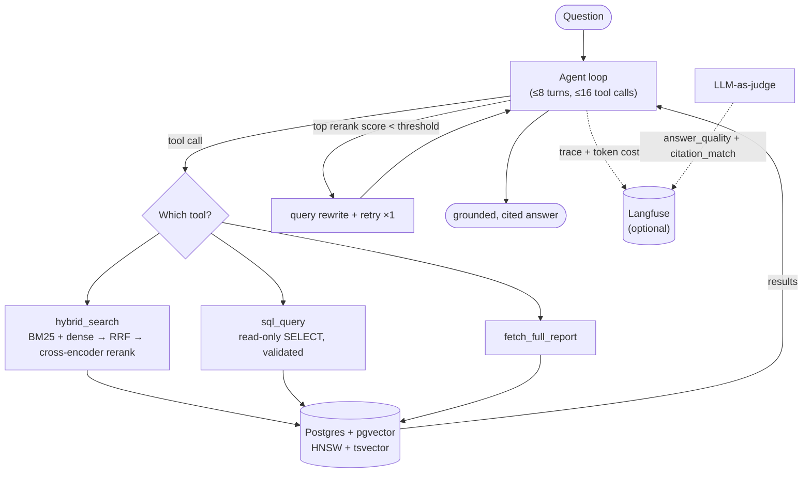
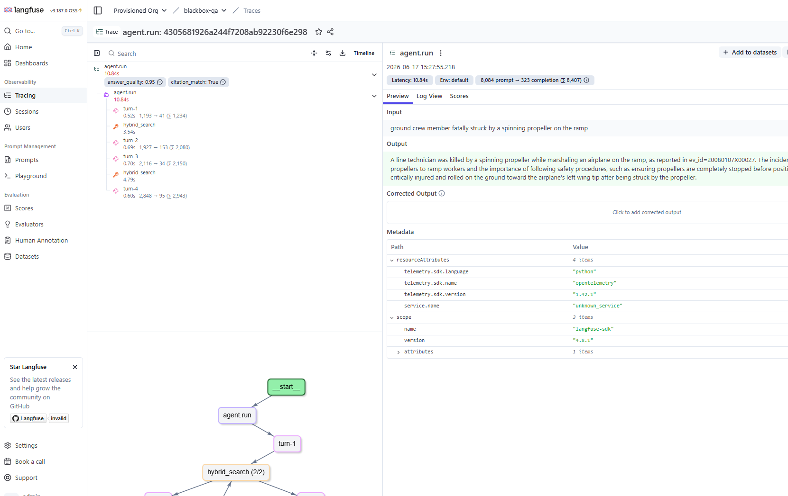
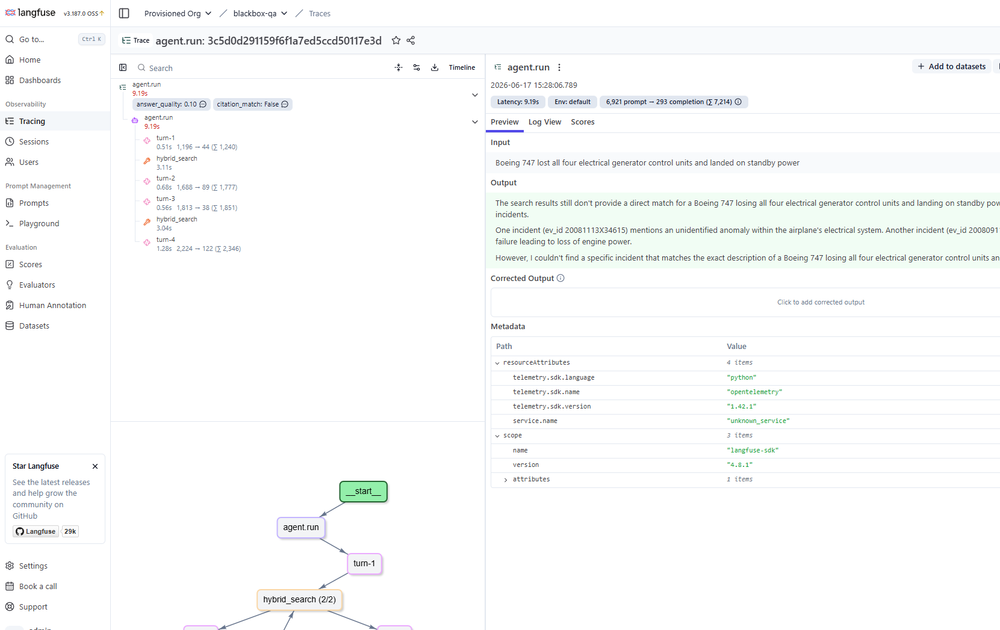

# blackbox-qa

Agentic question-answering over public **NTSB aviation incident reports**.

> **Status: runs end-to-end.** Ingest → hybrid retrieval + rerank → tool-calling agent → self-hosted Langfuse tracing/scoring → a manually-triggered GitHub Actions eval pipeline are all built and green. Remaining work is a cloud deploy (phase 6) and doc polish (phase 7).

## What it is

A natural-language question goes in (`"were there more engine failures on 737s or A320s since 2015?"`); a grounded, cited answer comes out. Under the hood:

- **One Postgres database** (via `pgvector`) holds the incident reports relationally, their narrative chunks as dense embeddings (HNSW index), and a `tsvector` full-text index — so the same store serves keyword search, vector search, and SQL aggregation.
- **Hybrid retrieval**: BM25-style keyword search (Postgres FTS) + dense vector search, fused with **Reciprocal Rank Fusion (RRF)**. Optional cross-encoder reranking stage (measured as an ablation).
- **A raw tool-calling agent** (no framework) that chooses between three tools at runtime:
  - `hybrid_search` — retrieve relevant report chunks
  - `sql_query` — read-only aggregate queries over the structured fields
  - `fetch_full_report` — pull a full report by ID
  - Weak-evidence answers trigger one bounded query-rewrite + re-retrieval retry, gated on the **cross-encoder retrieval score** (a calibrated signal) rather than the model's self-report.
- **Observability**: every request traced in self-hosted **Langfuse** (optional Compose profile); LLM-as-judge scores posted back to the same traces via the Scores API.
- **Evaluation**: a frozen 25-query gold set drives a **manually-triggered** GitHub Actions pipeline (parameterized run modes: deterministic Recall@k, a temp-0 judge slice, a full judged run over the whole gold set). Architected to drop in as a merge-blocking retrieval-regression gate, but not currently wired as one.
- **`docker compose up`** runs the whole thing.

## Architecture



## Data

NTSB aviation accident data (1982–present) from <https://data.ntsb.gov/avdata/> — distributed as a Microsoft Access `.mdb` inside `avall.zip`. **Raw data is never committed.** `make ingest` downloads it and converts it to Postgres via `mdbtools`. Only the frozen gold set and a small (~20-report) CI fixture are committed.

## Quickstart

Dependencies are managed with [Poetry](https://python-poetry.org/) (`pyproject.toml` + `poetry.lock`).

```bash
poetry install                          # runtime + dev deps
# poetry install --extras observability # + Langfuse

make db-up        # start Postgres (pgvector) via docker compose
make ingest       # download NTSB data, convert .mdb, load + embed + index
make serve        # FastAPI app
# or:
poetry run blackbox-qa "your question here"
```

Prerequisites: Docker (Postgres) and `mdbtools` (`sudo apt install mdbtools`) for ingest. The agent needs an OpenAI-compatible LLM — copy `.env.example` to `.env` and add a (free) [Groq](https://console.groq.com) key (recommended; or Gemini/Ollama — any OpenAI-compatible endpoint works via env vars). The agent and judge use different models. Embeddings and the reranker run locally on CPU.

### The agent

A raw tool-calling loop (no framework) with three tools — `hybrid_search` (narrative search, reranked), `sql_query` (read-only `SELECT` over structured fields), and `fetch_full_report` (full report by `ev_id`). The loop is bounded (~8 turns + a total tool-call ceiling), validates tool arguments and feeds errors back for self-correction (unexpected tool failures are caught and returned, never crash the loop), and forces a text answer on the final turn (`tool_choice="none"`, with a repair step if the model still withholds text). The `sql_query` tool is guarded to single read-only `SELECT`s (rejected: multi-statement, DDL/DML, and side-effect functions like `pg_sleep`/`pg_read_file`) plus a DB-level read-only transaction and a least-privilege role. The LLM client retries on rate-limit (429 / Groq 413 TPM) with server-suggested backoff.

**Confidence gate.** The one query-rewrite retry fires on a *calibrated* signal: the top cross-encoder rerank score of the evidence the agent gathered. A low top score means nothing relevant was retrieved — a far more honest "should I retry?" input than the model's self-reported `CONFIDENCE` line, which tracks fluency, not evidence. The threshold is chosen against the gold set with a Youden's-J sweep (`python -m evals.run --mode calibrate`): across 25 queries the 3 failed retrievals top out at 3.21 while successes mostly sit far higher (mean ≈ 7.6), so the gate sits at **4.42** — catching every failed retrieval (TPR 1.0) at the cost of one needless retry on a genuinely-good answer (FPR 0.045). The self-report is still recorded alongside the score so the two can be compared. When no search ran (a SQL-only answer), the gate falls back to the self-report. The clean-looking margin is partly small-sample luck; treat 4.42 as a direction and re-calibrate as the gold set grows (`evals/confidence_calibration.json`).

### Observability (optional)

Self-hosted Langfuse, behind a Compose profile (`docker compose --profile observability up`): each agent run is a trace, with a generation per LLM turn (token usage → cost) and a span per tool call. Quality is scored out-of-band and attached to the run's trace by `trace_id` via the Scores API — a deterministic `citation_match` (did it cite a gold `ev_id`?) and an LLM-as-judge `answer_quality` (0–1). Tracing is async/batched so it adds no latency to the request; when `LANGFUSE_ENABLED=false` (default) all of it is a no-op. Run the judge-scored slice with:

```bash
poetry run python -m evals.run --mode judge-slice --limit 5
```

A real agent run, traced — the observation tree (a generation per turn + a span per tool call), token usage, and both judge scores attached to the **same** trace:



The confidence gate doing its job on a query the retriever can't satisfy (*"747 lost all four generator control units"*): weak evidence → low judge scores (`answer_quality 0.10`, `citation_match False`):



## Results

On a 2008–2009 NTSB slice — 3,000 reports / ~14k narrative chunks, 25-query hand-curated gold set:

| Stage | Recall@5 | MRR |
|---|---|---|
| Hybrid (dense + FTS, RRF) | 0.88 | 0.75 |
| Hybrid + cross-encoder rerank | 0.88 | **0.88** |

Reranking can't add documents the first stage missed, so Recall@5 is unchanged; it reorders the candidate pool, lifting the right report higher and improving **MRR +0.13 (~17% relative)**. Queries are paraphrased so this reflects retrieval quality, not memorization. Reproduce:

```bash
poetry run python -m evals.run --mode retrieval --ablation --k 5
```

Baseline committed at `evals/baseline.json`, rerank ablation at `evals/ablation.json`.

## Failure modes & limitations

Things that are deliberately imperfect, and why — the honest version is more useful than a clean one.

- **`citation_match` understates the agent.** The retrieval gold maps each query to a single hand-picked `ev_id`, but the agent frequently cites a *different, equally valid* incident. So `citation_match` reads lower than the answer actually deserves — it's really a retrieval signal. `answer_quality` (the judge score) is the better agent-level metric.
- **Rerank can't recover what the first stage missed.** Recall@5 is capped by hybrid retrieval (0.88); the cross-encoder only reorders the existing candidate pool. The misses are paraphrase-heavy queries where neither BM25 nor dense surfaced the report into the pool — e.g. *"747 lost all four generator control units"* scored a top rerank of −0.73, well below anything relevant.
- **The confidence gate is calibrated on a small sample.** n=25, with only 3 failed retrievals. The threshold (4.42) separates them cleanly *here*, but that margin is partly luck — it's a direction, not a tuned constant. It also misfires occasionally: one genuinely-good answer scored −0.52 and would trigger an unnecessary retry (FPR 0.045).
- **SQL-only answers fall back to the weaker signal.** When the agent answers purely from `sql_query` aggregates (no `hybrid_search` ran), there's no rerank score to gate on, so it reverts to the model's self-reported confidence.
- **Free-tier rate limits shape the design.** Groq's per-model TPM caps (agent context grows every turn) drove the model choice and the 429/413 backoff. The judge CI tiers are intentionally manual rather than per-PR — both for cost and because judge scores have variance.
- **The corpus is a 2-year slice.** 2008–2009 (~3k reports) keeps local builds fast and reproducible; it is not the full 1982–present dataset.

## At 100x scale

What would change to run this at ~300k reports / ~1.4M chunks. The system was built so most of this is configuration, not a rewrite (every heavy component is already env-var-swappable and Compose-isolated).

- **Vector retrieval.** HNSW is already approximate; tune `m` / `ef_construction` / `ef_search` for the recall-vs-latency point you want, partition the chunks table by year with per-partition indexes, and watch pgvector's index build time + RAM — past a point a dedicated vector store (or IVFFlat for cheaper builds) earns its keep.
- **Reranking is the latency floor.** A cross-encoder is one forward pass per candidate on CPU. Cap the pool (rerank top-50, not top-200), batch on a GPU, or move it behind a served endpoint (e.g. TEI). The reranker and embedder are already separate, swappable models.
- **Embeddings.** Batch + GPU for ingest; promote the local sentence-transformers model to a serving endpoint so ingest and query share one warm model (the `EMBEDDING_MODEL` indirection is already there).
- **Database.** Connection pooling (pgbouncer), read replicas to absorb `sql_query` load, and materialized views for the common aggregations the agent asks for.
- **Agent cost/latency.** Cache retrieval per normalized query, keep the tool-call ceiling (already 16), and stream the final answer.
- **Observability.** Langfuse's ClickHouse backend handles high trace volume, but sample traces at high QPS and keep judge scoring out-of-band/async — which is already how it's wired.
- **Eval.** The deterministic retrieval gate scales directly into a blocking PR check; the judge tiers stay sampled/scheduled because of cost and variance.

## Phases

1. Ingest + hybrid retrieval + gold set (Recall@5 / MRR measured) ✅
2. (1.5) Cross-encoder rerank stage, reported as ablation numbers ✅
3. Agent loop — 3 tools, bounded iterations, arg validation, confidence-retry ✅
4. Langfuse tracing + judge scores via Scores API ✅
5. CI eval pipeline (GitHub Actions + pgvector service container, fixture-seeded, Recall@5 regression gate); calibrated retrieval-score confidence gate ✅
6. Deploy heavy components (Langfuse, embeddings, reranker, Postgres) to a VM / EC2
7. README as engineering doc — measured numbers, failure modes, "at 100x scale"

## License

MIT — see [LICENSE](LICENSE).
